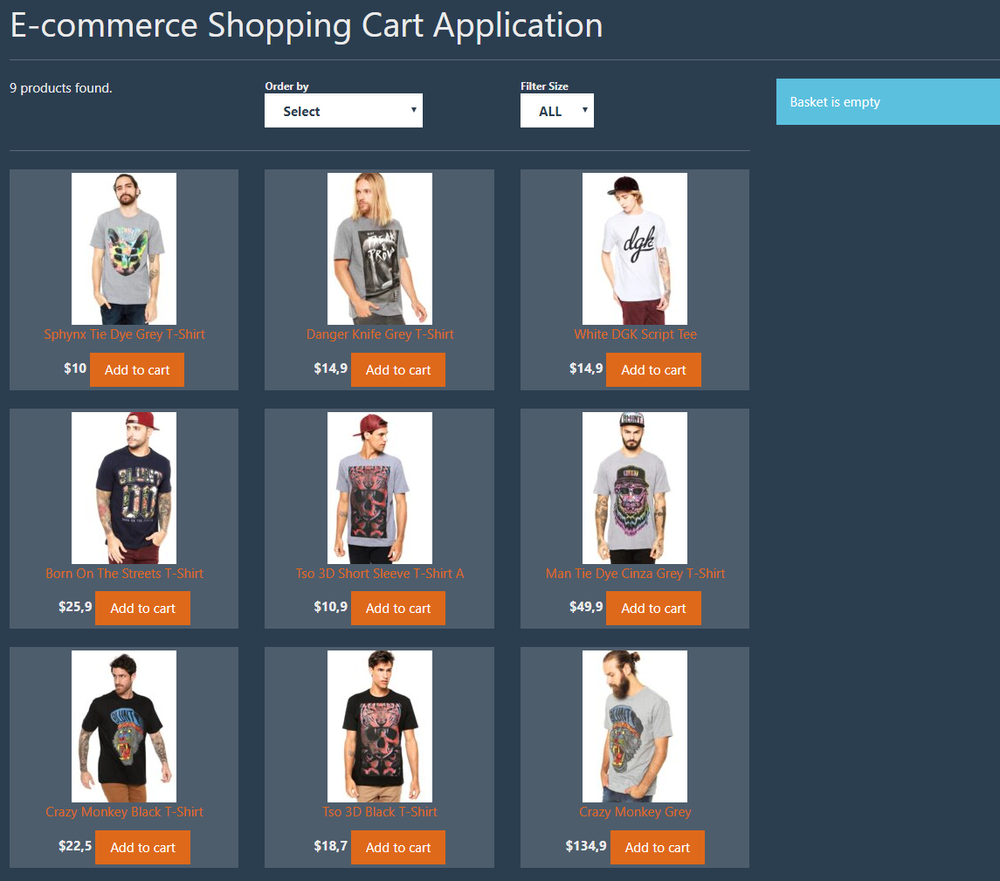

# Build-Ecommerce-Website-by-React-Redux-in-One-hour

This course let you gets your hand dirty by creating a simple shopping cart with React components. Soon you will find out how hard it is to manage states between nested React components. Here is where Redux comes into picture and let you move data and UI states to Redux store from react components. You will be able to do all the boilerplates to change a React Application to React&Redux application and implement different actions like fetching product from Restful API, adding items to cart, removing items from cart and etc with Redux.

#### install tools

Vs Code: download https://code.visualstudio.com

Git: download https://git-scm.com/downloads

Node.js: download https://nodejs.org/en/download

Yarn: download https://yarnpkg.com/en/docs/install


#### Installation

npm install

##### Run

npm run server

npm run start

open http://localhost:3000 in the browser

###### Create project

npm install -g create-react-app

mkdir myproject

cd myproject/

create-react-app ecommerce-shopping-cart

cd .\ecommerce-shopping-cart\

code .

yarn start

### Build Json Server

Install json-server
1. npm install -g json-server
2. it gives us a full fake REST API with zero coding

json-server public/db.json --port 8000

```
 Resources
  http://localhost:8000/products

  Home
  http://localhost:8000
  ```

  ### Add Bootstrap

  add Css

### Finish product

E-commerence Shopping Card Application
